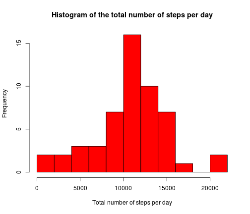
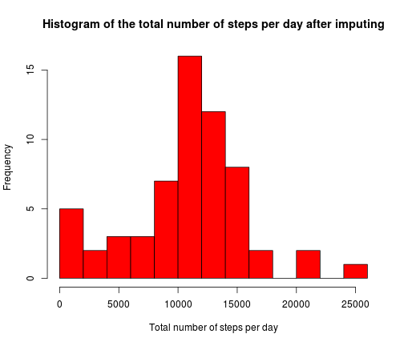
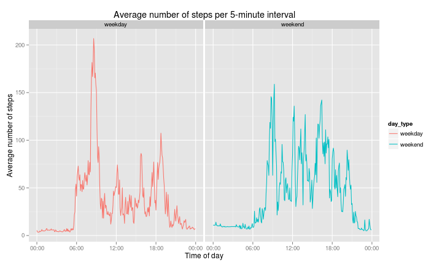

## Loading and preprocessing the data

I will first load all the libraries that will be used in this analysis

```r
library(dplyr)
library(lubridate)
```

The data is stored in csv format, it is thus easy to read:

```r
data <- read.csv("activity.csv", 
                 stringsAsFactors = FALSE)
head(data,15)
```

```
##    steps       date interval
## 1     NA 2012-10-01        0
## 2     NA 2012-10-01        5
## 3     NA 2012-10-01       10
## 4     NA 2012-10-01       15
## 5     NA 2012-10-01       20
## 6     NA 2012-10-01       25
## 7     NA 2012-10-01       30
## 8     NA 2012-10-01       35
## 9     NA 2012-10-01       40
## 10    NA 2012-10-01       45
## 11    NA 2012-10-01       50
## 12    NA 2012-10-01       55
## 13    NA 2012-10-01      100
## 14    NA 2012-10-01      105
## 15    NA 2012-10-01      110
```
Looking at the output above, we see that there are three variables: 

* steps
* date
* interval

The interval variable is stored as an integer, but is actually more like a code,
with the the last two digits as the minutes, and the first two (if present) as 
the hours. It will thus be useful for further processing to convert this 
interval into a time object. We can do this in the following way: 

```r
## Function to convert interval to something more useable
convert.interval <- function(interval){
  # pad the interval with 0's
  format.interval <- sprintf("%04d",interval)
  # convert to HH:MM
  as.POSIXct(format.interval, format="%H%M")
}

data$interval_new <- convert.interval(data$interval)
```
Let's have a look at the updated data frame:

```r
head(data)
```

```
##   steps       date interval        interval_new
## 1    NA 2012-10-01        0 2014-12-13 00:00:00
## 2    NA 2012-10-01        5 2014-12-13 00:05:00
## 3    NA 2012-10-01       10 2014-12-13 00:10:00
## 4    NA 2012-10-01       15 2014-12-13 00:15:00
## 5    NA 2012-10-01       20 2014-12-13 00:20:00
## 6    NA 2012-10-01       25 2014-12-13 00:25:00
```

## What is mean total number of steps taken per day?

A first thing we can look at, is the total number of steps the subject took 
each day. Any time intervals for which no data was taken, will be removed. 


```r
steps.per.day <- filter(data, complete.cases(data)) %>%
  group_by(date) %>%
  summarize(tot_steps = sum(steps))

head(steps.per.day)
```

```
## Source: local data frame [6 x 2]
## 
##         date tot_steps
## 1 2012-10-02       126
## 2 2012-10-03     11352
## 3 2012-10-04     12116
## 4 2012-10-05     13294
## 5 2012-10-06     15420
## 6 2012-10-07     11015
```

We now have the information on the total number of steps in table format. 
We will now make a histogram to get a better idea of how this total number of 
steps is distributed. 


```r
hist(steps.per.day$tot_steps, 
     col = "red",
     main = "Histogram of the total number of steps per day",
     xlab = "Total number of steps per day", 
     breaks = 10)
```

 


```r
mean.steps.per.day <- mean(steps.per.day$tot_steps)
median.steps.per.day <- median(steps.per.day$tot_steps)
```
Apart from this histogram it is also useful to summarize this information into 
a single number, such as the mean or median number of steps taken. The mean 
number of total steps per day that this subject has taken is 
10766, whereas the median is 
10765.

## What is the average daily activity pattern?

Another useful piece of information is how a typical day looks like for this
subject. For this we will average the number of steps per interval over all days.
We again remove all missing values first. 

```r
average.steps.per.interval <- filter(data, complete.cases(data)) %>%
  group_by(interval_new) %>%
  summarize(m=mean(steps))
head(average.steps.per.interval)
```

```
## Source: local data frame [6 x 2]
## 
##          interval_new       m
## 1 2014-12-13 00:00:00 1.71698
## 2 2014-12-13 00:05:00 0.33962
## 3 2014-12-13 00:10:00 0.13208
## 4 2014-12-13 00:15:00 0.15094
## 5 2014-12-13 00:20:00 0.07547
## 6 2014-12-13 00:25:00 2.09434
```
We can visualize this as a time-series plot:

```r
with(average.steps.per.interval, plot(interval_new, m, 
                                      type="l",
                                      ylab="Average number of steps",
                                      xlab="Time of day",
                                      main="Average number of steps per 5-minute interval"))
```

 

From this plot we can already see that the subject usually takes many steps in 
the morning. We can also compute during which exact time interval the subject 
records the most steps on average. 

```r
max.av.steps.interval <- average.steps.per.interval[[which.max(average.steps.per.interval$m),1]]
max.hour <- hour(max.av.steps.interval)
max.minute <- minute(max.av.steps.interval)
```
The interval with the most steps is the 5-minute interval starting at 
8h35. 

## Imputing missing values

It is useful to look at how much missing data we have in the dataset. 

```r
missing <- !complete.cases(data)
n.missing <- sum(!complete.cases(data))
```
There are 2304 missing elements in the dataset. 

Rather than just ignoring this missing data as before, we can also make an 
attempt at filling in this missing data. For days where most of the data was missing, 
this will probably give more reasonable results for the total number of steps per day. 
Of course, as the data is actually missing, this can only be an approximation. 
Here, missing data will be replaced by the mean number of steps per 5-minute
interval. 

```r
# Make data frame containing only the missing intervals
df.missing <- data.frame(interval_new=data$interval_new[missing],date=data$date[missing])
# Merge this with the average number of steps per interval. This merged data frame
# will now contain the average number of steps for each missing interval
merged.df <- merge(df.missing, average.steps.per.interval, by="interval_new") %>%
  arrange(date,interval_new)
# Now replace the missing data. Store it in a new variable.
data.filled <- data
data.filled$steps[missing] <- merged.df$m

head(data.filled)
```

```
##     steps       date interval        interval_new
## 1 1.71698 2012-10-01        0 2014-12-13 00:00:00
## 2 0.33962 2012-10-01        5 2014-12-13 00:05:00
## 3 0.13208 2012-10-01       10 2014-12-13 00:10:00
## 4 0.15094 2012-10-01       15 2014-12-13 00:15:00
## 5 0.07547 2012-10-01       20 2014-12-13 00:20:00
## 6 2.09434 2012-10-01       25 2014-12-13 00:25:00
```

We can now have a look at the effect of imputing the missing values. First we
again make a plot of the total number of steps per day. 

```r
steps.per.day.filled <- group_by(data.filled,date) %>%
  summarize(tot_steps = sum(steps))

head(steps.per.day.filled)
```

```
## Source: local data frame [6 x 2]
## 
##         date tot_steps
## 1 2012-10-01     10766
## 2 2012-10-02       126
## 3 2012-10-03     11352
## 4 2012-10-04     12116
## 5 2012-10-05     13294
## 6 2012-10-06     15420
```


```r
hist(steps.per.day.filled$tot_steps, 
     col = "red",
     main = "Histogram of the total number of steps per day after imputing",
     xlab = "Total number of steps per day", 
     breaks = 10)
```

 

```r
mean.steps.per.day.filled = mean(steps.per.day.filled$tot_steps)
median.steps.per.day.filled = median(steps.per.day.filled$tot_steps)
```
The mean and median number of steps per day that correspond to this are
10766 and 10766.

The effect of imputing can be better viewed in a relative way:

```r
# Relative effect of imputing on the mean steps per day
mean.effect <- (mean.steps.per.day.filled - mean.steps.per.day)/mean.steps.per.day
mean.effect
```

```
## [1] 0
```

```r
# Relative effect of imputing on the median steps per day
median.effect <- (median.steps.per.day.filled - median.steps.per.day)/median.steps.per.day
median.effect
```

```
## [1] 0.0001104
```
The effect on the mean is exactly zero, as we would expect given that we have
used the mean to impute the missing values, and given that if values are missing
in this dataset, they are missing for the full day.  
The effect on the median is very small, only 1 step in absolute numbers, which
corresponds to a sub permille effect. 

## Are there differences in activity patterns between weekdays and weekends?

To check the influence of weekdays and weekends on the subject's activity, we 
add a new factor variable to our dataset that contains whether a given day was
a weekday or a weekend day. 


```r
# define function that returns "weekend" or "weekday" for a given date
day.type <- function(date){
  day <- weekdays(date)
  day.type.per.item <- function(item){
    if(item %in% c("Saturday","Sunday")){
      "weekend"
    } else {
      "weekday"
    }
  }
  sapply(day, day.type.per.item)
}

# convert the date variable to a Date format
data.filled <- mutate(data.filled, 
                      date = as.Date(date),
                      day_type = day.type(date),
                      day_type = as.factor(day_type))
# Have a look at the output
head(data.filled)
```

```
##     steps       date interval        interval_new day_type
## 1 1.71698 2012-10-01        0 2014-12-13 00:00:00  weekday
## 2 0.33962 2012-10-01        5 2014-12-13 00:05:00  weekday
## 3 0.13208 2012-10-01       10 2014-12-13 00:10:00  weekday
## 4 0.15094 2012-10-01       15 2014-12-13 00:15:00  weekday
## 5 0.07547 2012-10-01       20 2014-12-13 00:20:00  weekday
## 6 2.09434 2012-10-01       25 2014-12-13 00:25:00  weekday
```

```r
# check the class
class(data.filled$date)
```

```
## [1] "Date"
```

```r
# check the class
class(data.filled$day_type)
```

```
## [1] "factor"
```

Now we can make a time series plot to see the average daily step pattern, broken
up into two categories. We use the same procedure as before. 


```r
average.steps.per.interval.by.daytype <- group_by(data.filled, day_type, interval_new) %>%
  summarize(m=mean(steps))
head(average.steps.per.interval.by.daytype)
```

```
## Source: local data frame [6 x 3]
## Groups: day_type
## 
##   day_type        interval_new       m
## 1  weekday 2014-12-13 00:00:00 2.25115
## 2  weekday 2014-12-13 00:05:00 0.44528
## 3  weekday 2014-12-13 00:10:00 0.17317
## 4  weekday 2014-12-13 00:15:00 0.19790
## 5  weekday 2014-12-13 00:20:00 0.09895
## 6  weekday 2014-12-13 00:25:00 1.59036
```

Let's now make the actual plot. I will use qplot here as it has nice facetting
features. 


```r
library(ggplot2)
library(scales)
qplot(interval_new, m,
      data = average.steps.per.interval.by.daytype, 
      facets = . ~ day_type,
      geom = c("line"),
      color = day_type,
      ylab="Average number of steps",
      xlab="Time of day",
      main=c("Average number of steps per 5-minute interval")
    ) + scale_x_datetime(labels=date_format("%H:%M"))
```

 

We can clearly see a difference in the daily activity pattern. On weekdays the
subject gets up earlier, and then does some activity that records many steps. 
On weekends there is more activity spread out during the day. 
